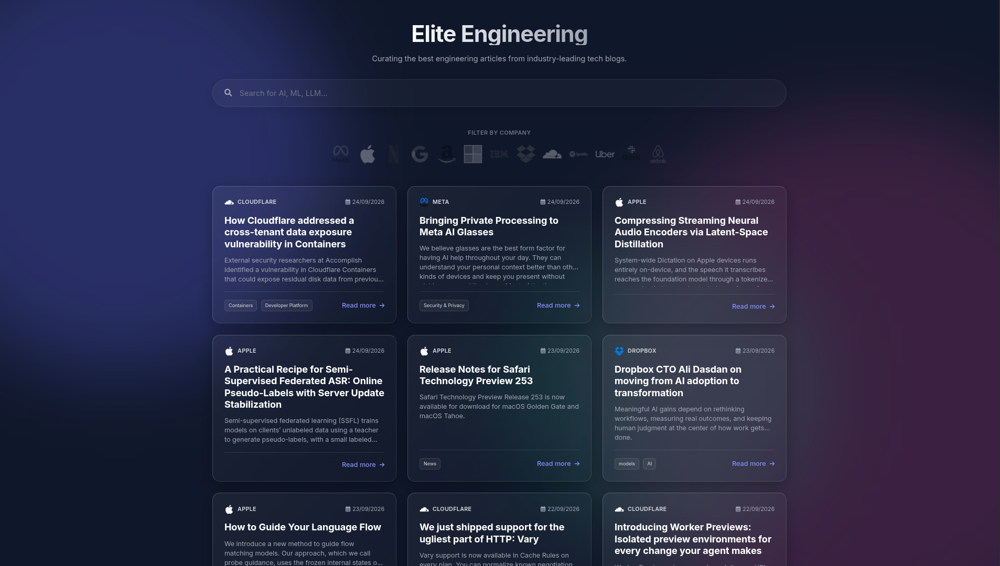

> Curating the best engineering articles from industry-leading tech blogs.

**Elite Engineering** is an aggregator of news and articles covering software engineering, system architecture, and infrastructure. It consumes-in real time-the official RSS/Atom feeds from the world's leading technology companies (such as Meta, Apple, Cloudflare, Dropbox, and GitHub), centralizing high-level technical knowledge within a single, modern, and responsive interface.
